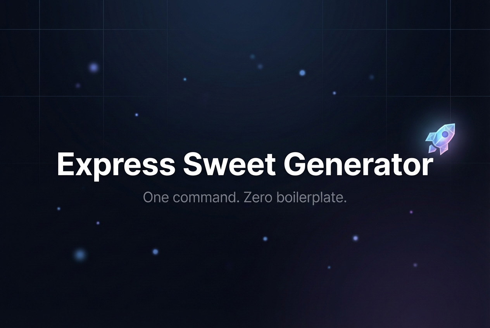
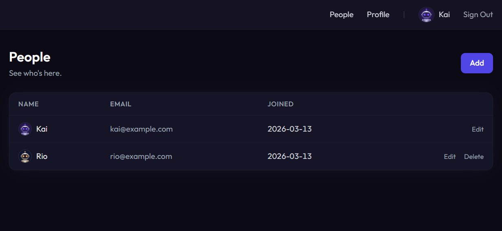
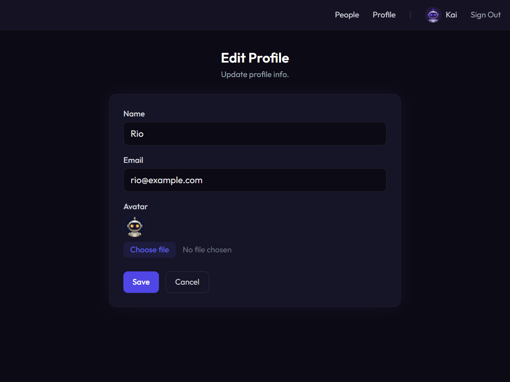

<p align="center">
  
</p>

<p align="center">
  <a href="https://www.npmjs.com/package/express-sweet-generator"></a>
  <a href="LICENSE"></a>
</p>

One command, zero boilerplate. Instantly scaffold a full-stack [Express Sweet](https://www.npmjs.com/package/express-sweet) app — authentication, database, file uploads, file-based routing, and Handlebars views — all wired up and ready to run.

## What Does It Generate?

A complete Express Sweet application with:

- **Passport.js authentication** — Login, session management, and route protection
- **SQLite + Sequelize** — Zero-config database with setup script included
- **File-based routing** — Drop a file in `routes/`, it becomes an endpoint
- **Handlebars views** — Layouts, error pages, and 37 built-in helpers
- **Multer file uploads** — Avatar upload with configurable storage
- **Tailwind CSS** — Clean, modern UI out of the box
- **ESM or CJS** — Choose your module format with a single flag

No build tools, no boilerplate, no decision fatigue. Just a working app.

## Tech Stack

| Layer | Technology |
|-------|------------|
| Framework | [Express Sweet](https://github.com/shumatsumonobu/express-sweet) v5 on Express.js |
| Auth | Passport.js (local strategy + session) |
| Database | SQLite via Sequelize (swap to MySQL/PostgreSQL anytime) |
| Views | Handlebars with 37 built-in helpers |
| File Upload | Multer |
| Styling | Tailwind CSS (CDN) |

## Screenshots

| Sign In | Home | People |
|---------|------|--------|
|  |  |  |

| New Person | Edit Profile | Change Your Look |
|------------|-------------|-----------------|
|  |  |  |

## Installation

```bash
npm install -g express-sweet-generator
```

## Quick Start

```bash
# Generate a new app (CJS by default)
express-sweet myapp

# Or generate an ESM app
express-sweet -o esm myapp

# Set up and run
cd myapp
npm install
npm run setup
npm start
```

Open `http://localhost:3000` and sign in with `kai@example.com` / `password123`.

## Command Options

```
express-sweet [options] [dir]

Options:
  -o, --output <output>   Module format: esm or cjs (default: cjs)
  -f, --force             Force creation in a non-empty directory
  -V, --version           Display version number
  -h, --help              Display help for command
```

## What's Inside

| Screen | URL | Feature |
|--------|-----|---------|
| Sign In | `/login` | Passport.js authentication |
| Home | `/` | Session data, Handlebars helpers |
| People | `/users` | Sequelize model, `findAll` |
| New Person | `/users/new` | Form POST, `create` |
| Edit Profile | `/users/:id/edit` | Form PUT, `update` |
| Remove | `/users/:id` (DELETE) | Self-delete protection |
| Change Your Look | `/profile/avatar` | Multer file upload |
| Sign Out | `/logout` | Session destroy |

## Generated Application Structure

```
myapp/
├── .env                    # Environment variables (PORT, NODE_ENV)
├── app.js                  # Application entry point
├── setup.js                # Database setup script
├── ddl.sql                 # Database schema + seed data
├── package.json
├── config/
│   ├── config.js           # App settings, routing, error pages
│   ├── database.js         # SQLite connection
│   ├── authentication.js   # Passport.js config
│   ├── view.js             # Handlebars settings
│   ├── logging.js          # Morgan format
│   └── upload.js           # Multer config
├── public/
│   └── img/                # Avatar images
├── models/
│   └── UserModel.js        # Sequelize model
├── routes/
│   ├── home.js             # Dashboard (default route)
│   ├── login.js            # Auth login
│   ├── logout.js           # Session destroy
│   ├── users.js            # CRUD (list, create, edit, delete)
│   └── profile/
│       └── avatar.js       # File upload
└── views/
    ├── layout/
    │   └── default.hbs     # Shared layout with nav
    ├── home.hbs
    ├── login.hbs
    ├── users.hbs
    ├── users-new.hbs
    ├── users-edit.hbs
    ├── avatar.hbs
    └── errors/
        ├── 404.hbs
        └── 500.hbs
```

## File-based Routing

Files in `routes/` are automatically mapped to URL endpoints — no manual registration needed:

| File | URL |
|------|-----|
| `routes/home.js` | `/home` (also `/` via `default_router`) |
| `routes/login.js` | `/login` |
| `routes/logout.js` | `/logout` |
| `routes/users.js` | `/users`, `/users/new`, `/users/:id/edit`, `/users/:id` |
| `routes/profile/avatar.js` | `/profile/avatar` |

## Express Sweet Documentation

The generated app is built on the [Express Sweet](https://github.com/shumatsumonobu/express-sweet) framework.
For configuration, models, authentication, routing, views, file uploads, and more — see the **[Express Sweet README](https://github.com/shumatsumonobu/express-sweet#readme)**.

## Changelog

See [CHANGELOG.md](CHANGELOG.md) for the full release history.

## Author

**shumatsumonobu**

* [github/shumatsumonobu](https://github.com/shumatsumonobu)
* [x/shumatsumonobu](https://x.com/shumatsumonobu)
* [facebook/takuya.motoshima.7](https://www.facebook.com/takuya.motoshima.7)

## License

[MIT](LICENSE)
